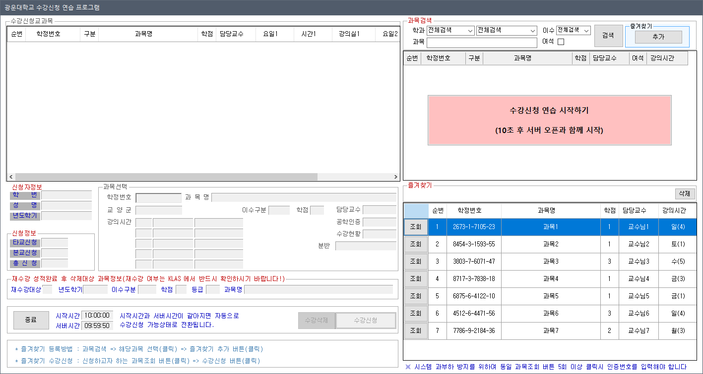
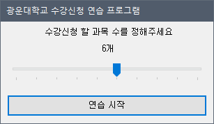
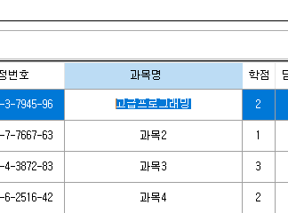
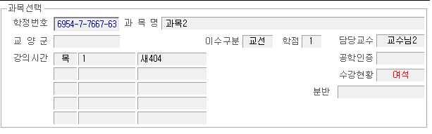
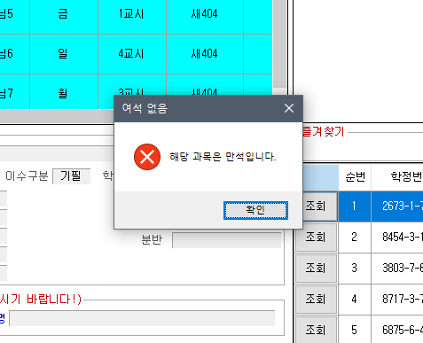
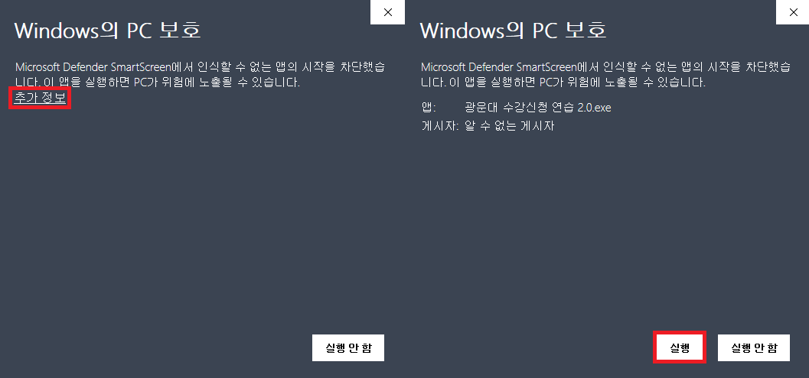

# 광운대학교 수강신청 연습 프로그램

버전 | 조회수 (오늘 / 누적)
---|---
이전 버전| 
현재 버전| 

광운대학교 학생들을 위한 수강신청 모의 연습 프로그램입니다.

최신버전: v2.1 [다운로드](https://github.com/kw-service/kw-class-registration/releases/tag/v2.1)

 

## 설명

실제 수강신청 프로그램과 완전히 동일한 인터페이스를 갖추고 있습니다.

`수강신청 연습 시작하기` 버튼을 누르면 수강신청 시작 10초 전 상황을 가정합니다.

수강신청이 시작되면 실제 프로그램과 동일하게 시작 알림창이 뜨며

과목별로 `조회` 버튼을 누르고 `수강신청` 버튼을 눌러 수강신청을 진행합니다.

 

## 기능

- 과목 수 지정
  

수강신청 할 과목 수를 직접 지정할 수 있습니다. (최대 10개)

 

- 과목 자동 추가 및 세부 내용 변경

지정한 과목 수 만큼 자동으로 과목이 즐겨찾기에 추가되며 과목명과 같은 세부 정보를 수정할 수 있습니다.

 

- 과목 조회 딜레이

실제 수강신청 시 서버 간 통신으로 인해 과목 조회 버튼 클릭 시 일정시간 딜레이가 발생하는 현상을 연습 프로그램에도 동일하게 적용시켰습니다.

딜레이는 일정하지 않고 `0.3초` ~ `0.5초` 만큼 랜덤하게 발생합니다.

 

- 만석인 상황 대비

실제 상황에서 원하던 과목이 만석이 되는 상황을 겪을 수 있습니다.

이때는 당황하지 않고 빠르게 `알림창`을 닫고 다른 과목의 수강신청을 이어나가야 합니다.

이에 대비할 수 있게 **일정 확률**로 신청하려는 과목이 `만석`이 되게끔 구현했습니다.

한 번 만석이 된 과목은 수강신청할 수 없습니다.

 

## 프로그램 실행을 위해

개인이 개발한 프로그램이라 최초 실행 시 위와 같은 창이 뜹니다.

`추가정보` 클릭 → `실행` 클릭 순으로 진행하시면 됩니다.

일부 까다로운 백신에서는 본 프로그램의 실행을 지속적으로 막을 수 있습니다. 이럴땐 백신을 잠시 종료하거나 검사 예외로 설정 후 실행하셔야 합니다. 오픈 소스로 공개한 만큼 안전한 프로그램이니 걱정은 안하셔도 됩니다.

또한 이 프로그램은 실제 수강신청 프로그램과 동일하게 실행을 위해서 `.NET Framework`의 설치가 필요합니다. 따라서 이 프로그램의 실행 여부로 실제 수강신청 프로그램의 설치 가능 여부를 판단할 수 있습니다.

 

프로그램 관련 문의: me@yjyoon.dev

개발: 18학번 소프트웨어학부 화석

